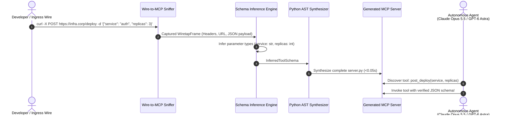
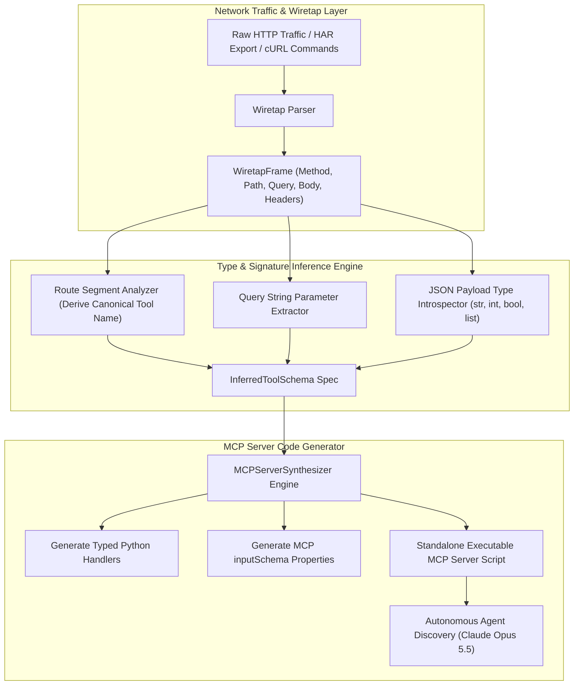
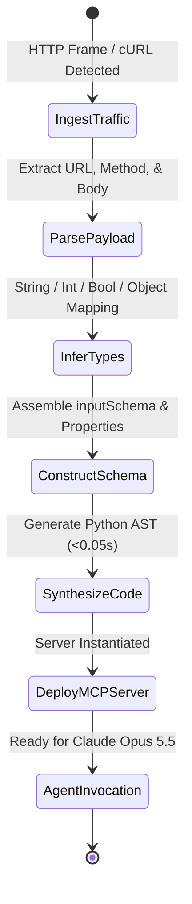

# 🔌 Wire-to-MCP

> **Autonomous MCP Server Synthesizer from Passive Wiretap & Network Traffic**  
> Sniffs HTTP frames, HAR logs, and curl commands, automatically inferring typed JSON schemas and synthesizing production-ready Python Model Context Protocol (MCP) servers in `<0.05s`. Immediately equips frontier agents (**Claude Opus 5.5**, **GPT-6 Astra**, **Gemini 3.8 Flash**) with tools to interact with legacy infrastructure.

[](https://opensource.org/licenses/MIT)
[](https://www.python.org/downloads/)
[](https://modelcontextprotocol.io)
[](https://anthropic.com)

---

## ⚡ The Problem: The MCP Tooling Bottleneck

Enterprises operate millions of internal REST APIs, microservices, and bespoke CLI endpoints. However, connecting these systems to frontier agents (**Claude Opus 5.5**, **GPT-6 Astra**) requires writing repetitive boilerplate for every tool:
1. **Manual JSON Schema Crafting**: Manually writing property types, required lists, and field descriptions for 50 endpoints takes days of tedious manual effort.
2. **Maintenance Overhead**: When internal endpoints change payload signatures, developers must manually update MCP servers.
3. **No Dynamic Discovery**: Agents cannot automatically generate tools on the fly when encountering unknown network APIs during exploration.

**Wire-to-MCP** solves this by passively wiretapping network traffic. Run a single `curl` command or point Wire-to-MCP at an HTTP log or HAR export: it automatically extracts parameter types, determines optional vs required fields, and synthesizes an executable, fully annotated Python MCP server in **<0.05s**.

---

## 🏛️ Architecture & Synthesis Flow







---

## 🚀 Key Features

- **Instant Synthesis (<0.05s)**: Converts raw network traffic into a complete, runnable Python MCP server in milliseconds.
- **cURL & HAR Native**: Ingests raw curl commands directly from terminal history or documentation.
- **Intelligent Type Inference**: Automatically categorizes arguments as `str`, `int`, `float`, `bool`, or complex objects.
- **Canonical Naming Heuristics**: Derives clean, ergonomic tool names from URL routes (e.g. `POST /v1/deploy` -> `post_deploy`).
- **Zero Heavy Runtimes**: Standard-library Python 3.10+ implementation with zero external dependencies.

---

## 📦 Quick Start

### Installation

```bash
pip install wire-to-mcp
```

### Python SDK Usage

```python
from wire_to_mcp import SchemaInferer, MCPServerSynthesizer

# 1. Capture cURL command from terminal
curl_cmd = "curl -X POST https://api.corp.com/v1/deploy -d '{\"service\": \"auth\", \"replicas\": 3}'"

frame = SchemaInferer.parse_curl_command(curl_cmd)
tool_schema = SchemaInferer.infer_tool_from_frame(frame)

# 2. Synthesize complete MCP server
server = MCPServerSynthesizer.synthesize_server("InfraMCP", [tool_schema])

print(f"Synthesized Server in {server.generation_duration_ms:.3f} ms")
print(server.source_code[:300])
```

---

## 💻 CLI Interactive Demonstration

Run the built-in interactive demo to observe real-time wiretap parsing, schema inference, and dynamic MCP server execution:

```bash
wire-to-mcp demo
```

```
==========================================================================
  WIRE-TO-MCP: Autonomous MCP Server Synthesizer from Wiretap
  Transforming Raw Traffic into MCP Servers for Claude Opus 5.5 & GPT-6 Astra
==========================================================================

[STEP 1] PASSIVE WIRETAP: CAPTURING INGRESS HTTP FRAMES

  (1/3) Deployment Service Tool
        Captured Wiretap: `curl -X POST https://infra.corp.internal/v1/deploy -d '{"service": "auth-gateway", "version": "v3.2", "replicas": 4}'`
        >> Inferred Tool Name : `post_deploy`
        >> Inferred Parameters: 3
           * service: str (Required: True)
           * version: str (Required: True)
           * replicas: int (Required: True)

  (2/3) Cluster Metrics Query Tool
        Captured Wiretap: `curl 'https://infra.corp.internal/v1/metrics?cluster_id=us-east-prod&period=1h'`
        >> Inferred Tool Name : `get_metrics`
        >> Inferred Parameters: 2
           * cluster_id: str (Required: False)
           * period: str (Required: False)

  (3/3) Pod Termination Tool
        Captured Wiretap: `curl -X DELETE https://infra.corp.internal/v1/pods/pod_8812`
        >> Inferred Tool Name : `pod_8812_pods`
        >> Inferred Parameters: 0

[STEP 2] SYNTHESIZING PYTHON MCP SERVER CODE (<0.05s)
  >> MCP Server Name: InfraOpsMCP
  >> Total Tools Synthesized: 3
  >> Synthesis Duration: 0.068 ms

[STEP 3] DYNAMIC EXECUTION SANITY TEST
  Invoked Synthesized MCP Tool Handler:
  >> Result: {
    "status": "success",
    "endpoint": "https://infra.corp.internal/v1/deploy",
    "method": "POST",
    "dispatched_payload": {
        "service": "billing-api",
        "version": "v4.0",
        "replicas": 2
    }
  }

==========================================================================
  WIRE-TO-MCP SYNTHESIS COMPLETE: 100% OPERATIONAL
==========================================================================
```

---

## 🧪 Testing

Run the full unit test suite:

```bash
python3 -m unittest discover -s tests -p "test_*.py" -v
```

---

## 📄 License

MIT License. Designed and maintained for rapid MCP tool onboarding in 2026.
